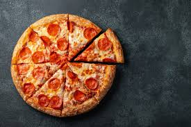
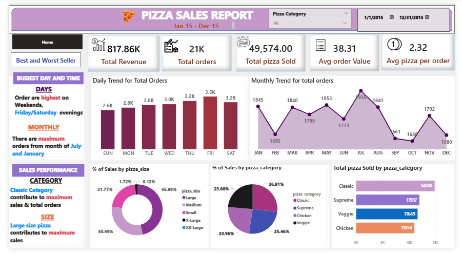
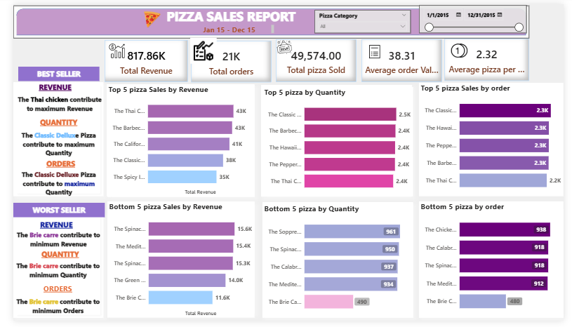

# Pizza_Sales_Dashboard

##**Introduction**
This Pizza Sales Report is a business intelligence dashboard designed to provide a comprehensive overview of sales performance for a pizza business. It covers the period from January 1, 2015, to December 31, 2015. *The dashboard is segmented into two main views: a "Home" page that summarizes overall performance and key trends, and a "Best and Worst Seller" page that details product-specific performance. The primary goal is to translate raw sales data into actionable insights for strategic decision-making*.

##**Problem Statement**
The dashboard aims to address several key business questions:
1  What are the overall sales performance metrics (Revenue, Orders, Volume)?
2  What are the key sales trends over time (daily and monthly)?
3  Which pizza categories, sizes, and specific products are driving the most revenue and sales volume?
4  Conversely, which products are underperforming?
5  When are the peak business hours and months, and how can this information be used to optimize operations?

##**Skills Demonstrated**
The dashboard has demonstrated a strong proficiency in the following areas:
1  Business Intelligence: Effective use of a BI tool (likely Power BI) to connect to data and build a multi-page report.
Data Visualization: Selection of appropriate charts (bar, line, donut) to represent different types of data effectively. The design is clean, with good use of color and spacing.
2  KPI Development: Identification and calculation of key performance indicators (KPIs) such as Total Revenue, Average Order Value, and Average Pizzas per Order.
Dashboard Design: Creation of an intuitive and user-friendly interface with clear navigation ("Home," "Best and Worst Seller") and interactive filters (Pizza Category, Date).
3  Data Analysis: Summarizing key findings directly on the dashboard (e.g., "Busiest Day and Time," "Best Seller" summaries), which helps guide the end-user to the most important insights.

##**Data Transformation**
Calculated Columns/Measures:
Total Revenue was likely calculated by multiplying the quantity of each pizza sold by its price.
Average Order Value was calculated as Total Revenue / Total Orders.
Average pizza per order was calculated as Total pizza Sold / Total orders.
Date & Time Functions: The order_date field was used to extract day names (e.g., 'Friday') and month names (e.g., 'July') to enable trend analysis.
Data Aggregation: Data was summed and counted to create the high-level KPI cards (Total Revenue, Total Orders, Total Pizza Sold).
Text Concatenation: Pizza names, categories, or sizes might have been cleaned or combined for clearer labeling in charts.

##**Data Modelling**
An efficient data model is crucial for this dashboard. A plausible underlying model would be a star schema consisting of:
Fact Table: An Order_Details table containing transactional data like order_id, pizza_id, and quantity.
Dimension Tables:

A Pizzas Dimension containing attributes like pizza_id, pizza_name, category, size, and price.

An Orders Dimension with details like order_id, order_date, and order_time.

A Date Dimension (a standard BI practice) linked to the order_date to facilitate time-based analysis like monthly and daily trends.

These tables would be linked via relationships (e.g., one-to-many from the Pizzas table to the Order_Details table).

##**Analytics and Visualization**

The dashboard effectively uses visuals to convey insights.
Home View Insights:
Top-Level KPIs: The business generated $817.86K in revenue from 21K orders, selling a total of 49,574 pizzas. The average customer spends $38.31 per order, purchasing about 2.32 pizzas.
Peak Times: The business is busiest on Friday and Saturday evenings. The months of July and January see the highest number of orders, while there is a significant dip around September and October.
Sales Drivers by Type:
Category: The Classic category is the most significant contributor to both total orders and sales volume (14,888 pizzas sold).
Size: The Large pizza size is the clear favorite, accounting for nearly 46% of all sales.
Best and Worst Seller View Insights:
Top Performers:
By Revenue: The Thai Chicken Pizza is the top earner ($43K).
By Quantity & Orders: The Classic Deluxe Pizza is sold most frequently and is included in the highest number of individual orders.
Worst Performers:
The Brie Carre Pizza is consistently the worst-performing pizza across all key metrics: lowest revenue ($11.6K), lowest quantity sold (490), and fewest orders.

##**Feedback**

Clarity: The dashboard is clean, uncluttered, and easy to understand at a glance.
Actionable Summaries: The text boxes that explicitly state the key takeaways (e.g., busiest days, best sellers) are highly effective for users who need quick insights.
Good Visual Mix: The combination of KPI cards, bar charts for comparison, a line chart for trends, and donut charts for composition works well.
Areas for Improvement:
Data Inconsistency: There is a discrepancy in the date range. The main title says "Jan 15 - Dec 15," but the filter shows "1/1/2015 - 12/31/2015". This should be corrected for accuracy.
Chart Readability: The "XX-Large" slice in the % of Sales by pizza_size donut chart is too small (0.12%) to be effective. A horizontal bar chart might represent this data more clearly.
Labeling Accuracy: In the "Best Seller" view, the summary text identifies "The Classic Deluxe Pizza" as the top by quantity and orders, but the corresponding charts show "The Classic..." at the top. This needs to be consistent.

##**Recommendations**
1  Based on the analysis, the following actions are recommended:
2  Inventory Management:
3  Ensure a surplus of ingredients for top-selling pizzas like the Thai Chicken, Barbecued Chicken, and Classic Deluxe.
Consider either revamping the recipe/marketing for The Brie Carre Pizza or removing it from the menu due to its consistent poor performance.
4  Staffing and Operations:
5  Schedule additional staff on Friday and Saturday evenings to manage the high order volume and maintain service quality.
6  Marketing and Promotions:
7  Launch marketing campaigns during slower periods (e.g., September-October) to drive off-peak sales.
8  Create targeted promotions, such as a "combo deal" featuring 2-3 pizzas, capitalizing on the 2.32 average pizzas per order.
9  Heavily promote Large size pizzas and feature the high-revenue Thai Chicken Pizza in marketing materials.

